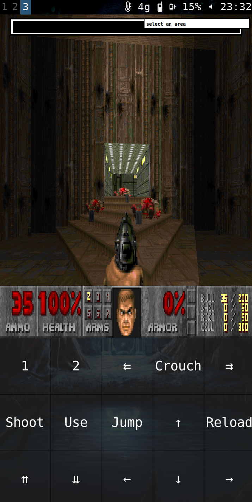

# DOOM-wvkbd a doom controller that sucks ~~less~~

I was messing with my pinephone and got lzdoom to work, however i couldnt find any on screen gamepads for wayland and i wanted to play witout bring plugged into a keyboard so i edited a wvkbd layout.
You'll need to change the keybindings in doom itself to get it to work.
Good luck, have fun!

I have a script to launch doom which is as follows
 `sxmo_keyboard.sh close & lzdoom & sleep 2 && ~/.local/src/DOOM-wvkbd/wvkbd-mobintl -O`

Note that the -O flag lets you press multiple keys at once so you can move and shoot at the same time.

# WARNING
Dont `sudo make install` this, i havnt changed the name of the binsry produced (cause idk how, if you do and you feel like it feel free to do a pr)
It will overwrite your normal wvkbd, just run `make` and then run the resulting binary whenever you run doom.
